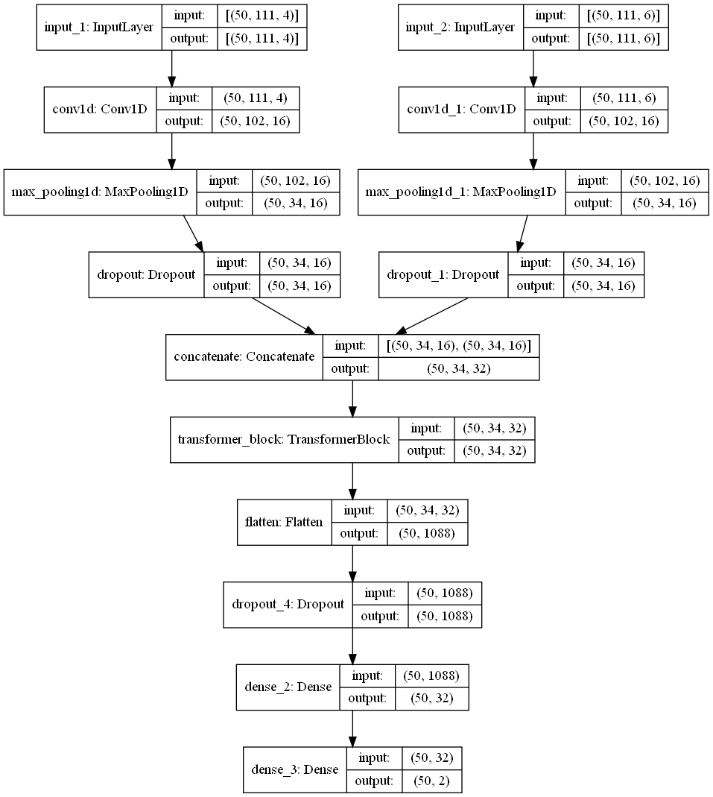

# Predicting RBP Binding Sites in RNA

This repo builds off of the iDeepS project at at https://github.com/xypan1232/iDeepS. The transformer model is contained in comp401.py, and the original LSTM model is contained in LSTM.py. The code for generating metrics is in comp401_evaluate.py.

## Dependencies
Tensorflow 2.0, Keras 2.0, RNAshapes Docker container, EDeN

## Model architecture
The transformer block used in the project was based on the example code provided by Keras API, with 7 layers and 32 attention heads. The transformer block replaces the original bidirectional LSTM layer that was present in the iDeepS model.

